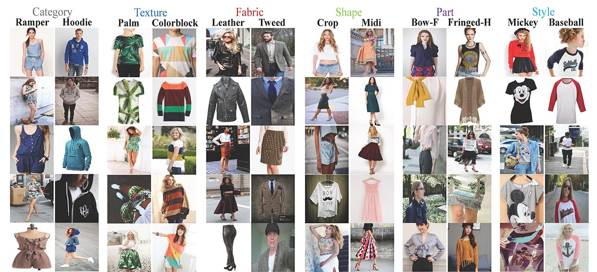
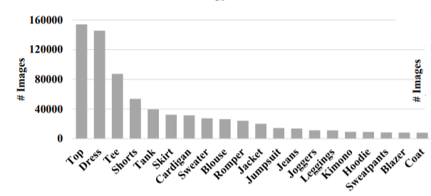
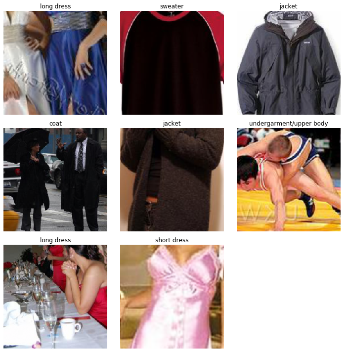
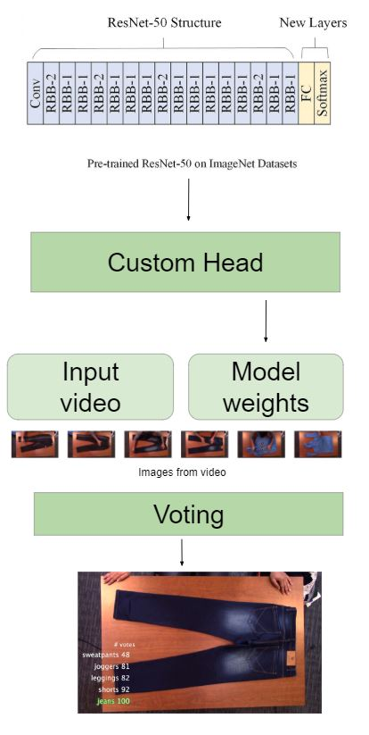
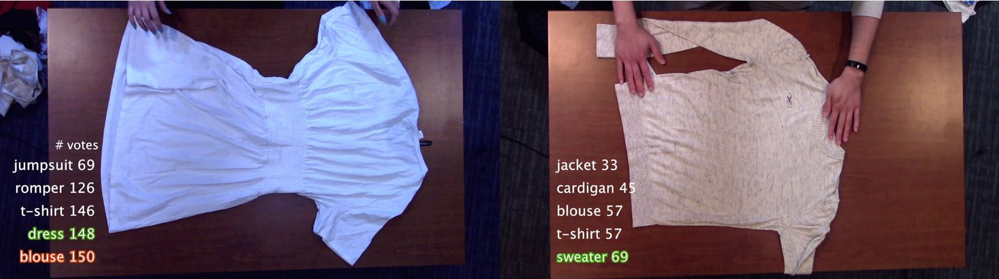
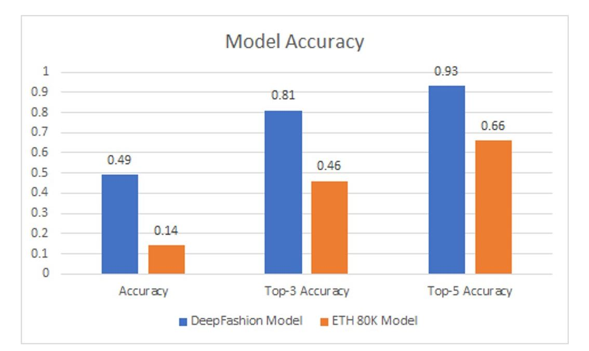
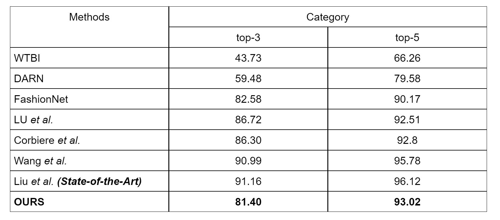

# GRINN : Garment Recognition In Neural Networks

## Motivation
2ULaundry, a company that takes care of your laundry for you, faces a serious problem of customer complaints about “missing” clothes due to lack of proper cataloging. This issue leads to customer’s loss of trust, which can potentially result in losing customers. Hence, we have come up with a solution "GRINN" to efficiently track the category and number of garments for every customer. This computer vision solution will help solve logistics and routing for 2ULaundry.

## DataSet

### Deep Fashion
Deep Fashion database, a large-scale clothes database,  contains over 800,000 diverse fashion images ranging from well-posed shop images to unconstrained consumer photos.

Sample Images from the dataset

* http://mmlab.ie.cuhk.edu.hk/projects/DeepFashion.html

Number of images for top 20 categories in DeepFashion dataset

### ETH80k Fashion Dataset
Example images of different categories in ETH80k Fashion dataset that is used for training.

* https://data.vision.ee.ethz.ch/cvl/lbossard/accv12/

## Proposed Model
Architecture for the model

#### Key Features of the Model are :
* The model and algorithm can work with video directly without having a person pick the best frames to make predictions on.
* With the overhead camera, we can capture, detect, and store the garments for every customer.​

## Results

Some example outputs from our pipeline. On the left-hand side of each example, top 5 predicted labels are shown along with their votes. Ground truth is displayed with green color. In case the ground truth and top-most predicted label differ, red represents the top predicted label.​

### Accuracy
Performance of our model on the test video using different training datasets.​

### Comparisions
 Comparative analysis of experimental results on the DeepFashion dataset. Results from our model are marked in bold.​

## Challenges
* Data Creation: As we did not have the original dataset from the factory floor. We created out own dataset by simulating the inspection table environment.
* Class Imbalnace: As we were creating the dataset as well as training our model, we saw a trend of class imbalance which caused some issues in predicition results initially.
* Multi Labeling And Genralisation of Lables: We are facing an issue where an item is being assigned multiple labels.

## Acknowledgements
* Adjunct professor, CCI:	Stephen Welch​
* Head of R&D, 2ULaundry: Gregory Baker​
